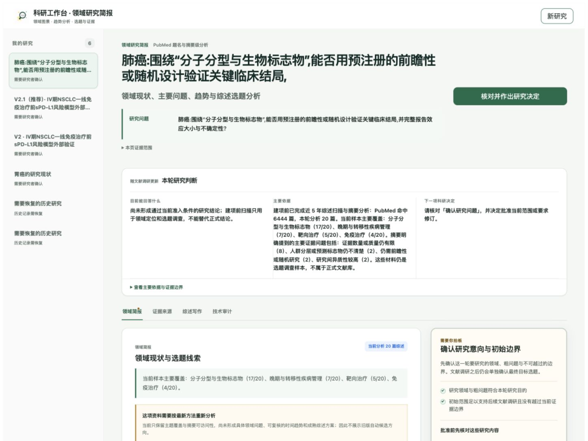

# awesome-papers

> 人类主导、可恢复、可审计的科研连续性工作台。
> A human-led, recoverable, auditable research continuity workbench.

`awesome-papers` is the new public name of Research Workbench. The existing
`/research-workbench` route, `RESEARCH_WORKBENCH_*` environment variables, and
local data directory remain unchanged for compatibility.



[](https://github.com/lseldouglas-art/awesome-papers/actions/workflows/ci.yml)
[](./LICENSE)
[](./ROADMAP.md)

## Current implementation — second-generation local Demo

**2026-09-13: [Demo v0.28.0 source](research-workbench-v2.0/) completes the three P0 engineering batches for continuous research before a personal, same-topic comparison with GPT.**

Adopted protocols now remain separate from editable drafts. External execution records and interpretations retain their actual inputs, actor and versions. Research tasks, writing and figures can carry exact dependencies, identify affected outputs after a change, and export the selected historical content with a separate provenance manifest. A small practice log records meaningful interruptions and work brought back from GPT.

The release also includes the v0.26–v0.27 source-grounded domain reading improvements. It reuses the existing research kernel, SQLite store, tasks and UI components; no runtime dependencies were added for P0.

- [P0 delivery, validation and remaining boundaries](research-workbench-v2.0/P0科研连续性优化与验收-v0.28.md)
- [Outcome-first design principles](docs/research-workbench-results-first-design-2026-09-12.md)
- [Install and run the second-generation Demo](research-workbench-v2.0/README.md)

**314 engineering checks and a production build passed**, together with desktop and narrow-screen interaction checks. Two public-material rehearsals used two real model calls; provider cost was unavailable. These checks do not establish scientific correctness, publication readiness, or superiority over GPT. The researcher's continuous trial and same-topic comparison are still to come. Credentials, local workspace databases, backups and private research screenshots are excluded from the public source.

The historical **v0.2** below names the direction proposed on 2026-09-04. **research-workbench-v2.0** names the second product generation; **0.28.0** is its current Demo package version. The root-level application remains the legacy implementation. Use the subdirectory instructions for the current Demo.

---

## Why this exists

Research assistants are good at producing fluent text, but fluent text is not the same as a defensible research result. awesome-papers keeps retrieval receipts, access levels, artifact lineage, review, human decisions, and export authority separate so that a candidate conclusion cannot silently become an approved one.

The current v0.1.4 product guides a researcher through five natural-language periods:

1. shape the research question;
2. search and calibrate the literature;
3. design an evidence-backed argument;
4. write and verify individual claims;
5. audit, freeze, and export the result.

## Historical v0.1.4 status (retained for comparison)

**v0.1.4 Alpha / local single-researcher release.** The core product loop is usable and tested. It is not yet a hosted multi-user service, a medical device, or a substitute for systematic-review, statistical, clinical, or ethical expertise.

### Historical v0.2 direction — recorded 2026-09-04

The v0.2 product direction and validation plan were adopted on 2026-09-04.
The next track reframes the project as a human-led research continuity layer:
research objects, evidence boundaries, human decisions, versions, and next
actions stay in one understandable and recoverable chain.

Completed so far:

- competitive and substitute-stack analysis;
- the product thesis, target wedge, build/partner boundaries, and four-stage plan;
- version isolation, success metrics, stop conditions, and evaluation boundaries.

Not completed yet:

- Phase 0 task contracts, interaction references, object model, flows, and wireframes;
- a v0.2 production codebase, live-model quality testing, or a connector;
- external researcher comparison, multi-user production hardening, or pricing validation.

The runnable baseline remains v0.1.4. An internal isolated evaluation record
reports 362 passing automated checks for selected persistence, authorization,
and recovery mechanisms, but the candidate is neither the v0.2 implementation
nor a public release. See the [v0.2 direction and stage gates](./docs/awesome-papers-v0.2-direction.md).

Working today:

- Chinese research-question input and transparent PubMed query preview;
- staged PubMed retrieval with immutable receipts;
- append-only project events and content-addressed artifacts;
- human-only gates and version-bound review decisions;
- pause, recovery, protocol revision, and cancellation boundaries;
- evidence brief, evidence outline, and audited-review completion profiles;
- researcher-facing stage brief with conclusions, evidence boundaries, and next decisions;
- a field-first workspace that leads with the domain landscape and keeps Pi runtime, workflow state, versions, and hashes in a technical-audit tab;
- a persistent two-round pre-project scoping record whose accepted candidate order, query, and researcher decision cannot be silently replaced;
- a single server-authored action contract shared by the visible workspace and researcher brief;
- fail-closed recovery that records interrupted Agent work without fabricating model provenance;
- four text-first report chapters that move from field landscape to one executable review direction;
- chapter-level PMID evidence drawers and a separately expandable complete source ledger;
- fail-closed second-round topic validation bound to the exact report, proposal, reasons, focus mapping, and query;
- restricted exports that fail closed when authority is incomplete.

See [ROADMAP.md](./ROADMAP.md) for the production gap.

## Quick start

Requirements: Node.js 22.19 or newer.

```bash
git clone https://github.com/lseldouglas-art/awesome-papers.git
cd awesome-papers
npm install
cp .env.example .env.local
npm run dev
```

Open <http://127.0.0.1:5177/research-workbench>.

Build and run the production server locally:

```bash
npm run build
npm start
```

Project data is stored under `.research-workbench-data/` by default and is ignored by Git.

## Runtime modes

- **Guided mode:** always available. It exercises the real state machine, persistence, PubMed tools, review gates, and exports with deterministic local Agent responses. Generated research prose remains explicitly non-authoritative.
- **Live model mode:** requires a supported provider configuration. Formal status is granted only when the project itself retains valid live-run provenance, non-zero usage, independent audits, an exact final library, and author sign-off.

Provider configuration alone never upgrades an older guided project.

## Scientific boundaries

- Large-scale screening is title/abstract-led by default.
- Missing abstract information remains **unknown**; it is never rewritten as “not performed.”
- Full text is requested only for targeted method, numerical, causal, safety, or formal-writing checks.
- PubMed coverage is not equivalent to multi-database systematic-review coverage.
- Candidate directions, generated prose, and workflow completion are not scientific findings.
- The checked-in gastric-cancer example is a frozen, time-stratified 20-record PubMed Best Match title-and-abstract sample. It is not a random sample, full-field publication count, bibliometric trend, or independently replayable proof of the original ranking.
- Topic coverage may overlap. Low frequency is not a research gap, and an uncoded primary axis is not evidence that a topic is absent from the full text.
- A 50–100-paper range is a candidate-discovery and workload-estimation target; final inclusion follows prespecified criteria. A 10–12-week range is a planning target that still depends on retrieval scope, staffing, deduplication, and full-text access.
- Final interpretation, authorship, and publication responsibility remain human.

## Architecture

```text
React workbench
      │
      ▼
Node HTTP/API server
      │
      ├── append-only project event logs
      ├── append-only pre-project scoping sessions
      ├── content-addressed artifacts
      ├── Agent run/tool lifecycle receipts
      ├── server-authored frontstage action contract
      ├── PubMed E-utilities gateway
      └── human gates and export authority
```

The UI is a projection of the research kernel; it cannot manufacture an approved state. See [docs/architecture.md](./docs/architecture.md).

## Tests

```bash
npm run test:core
npm run test:model
npm run test:ui
npm run test:api
npm test
```

The API test uses loopback-only test doubles and temporary data directories. No live PubMed or model credential is required for CI.

## Hosting safely

This release is single-researcher software. Do **not** expose an unprotected instance to the public internet: every visitor would otherwise share the same project space and human authority.

For a private hosted evaluation, configure both:

```bash
RESEARCH_WORKBENCH_AUTH_USERNAME=researcher
RESEARCH_WORKBENCH_AUTH_PASSWORD=use-a-long-random-secret
```

Use persistent storage for `RESEARCH_WORKBENCH_DATA_DIR`. See [docs/deployment.md](./docs/deployment.md).

For a disposable, password-protected evaluation instance only:

[](https://render.com/deploy?repo=https://github.com/lseldouglas-art/awesome-papers)

Render's free filesystem is ephemeral. Projects created there can disappear after idle shutdown, restart, or redeploy; do not use the free instance for real research records.

## Contributing

Start with [CONTRIBUTING.md](./CONTRIBUTING.md). Changes to scientific authority, event transitions, artifact contracts, retrieval semantics, or human decision ownership require tests that demonstrate both the allowed path and the fail-closed path.

## Security

Please use GitHub private vulnerability reporting instead of opening a public issue for sensitive findings. See [SECURITY.md](./SECURITY.md).

## License

[MIT](./LICENSE). Research outputs and third-party source material retain their own rights and responsibilities.
