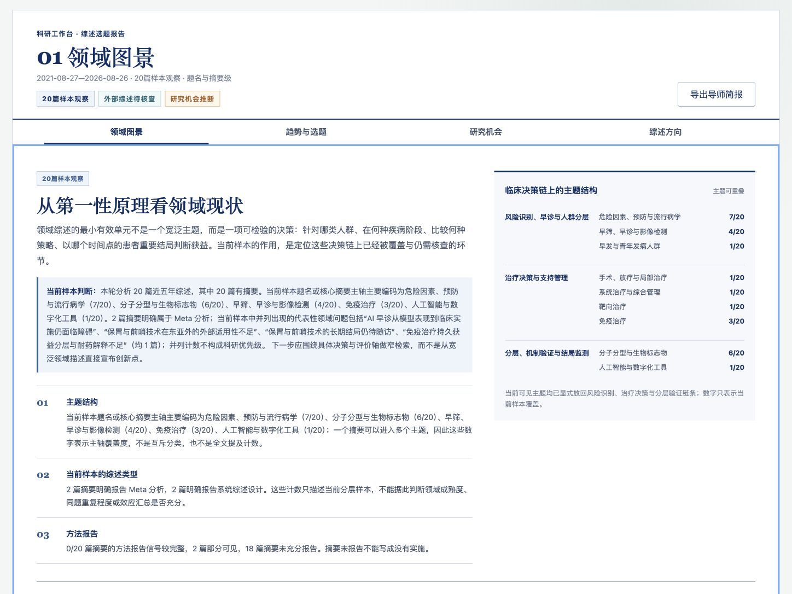

# Research Workbench

> 本地优先、可审计、证据边界明确的 PubMed 综述工作台。  
> A local-first, auditable workbench for evidence-bounded PubMed reviews.



[](https://github.com/lseldouglas-art/research-workbench/actions/workflows/ci.yml)
[](./LICENSE)
[](./ROADMAP.md)

## Why this exists

Research assistants are good at producing fluent text, but fluent text is not the same as a defensible research result. Research Workbench keeps retrieval receipts, access levels, artifact lineage, independent review, human decisions, and export authority separate so that a candidate conclusion cannot silently become an approved one.

The V1 product guides a researcher through five natural-language periods:

1. shape the research question;
2. search and calibrate the literature;
3. design an evidence-backed argument;
4. write and verify individual claims;
5. audit, freeze, and export the result.

## Current status

**Alpha / local single-researcher release.** The core product loop is usable and tested. It is not yet a hosted multi-user service, a medical device, or a substitute for systematic-review, statistical, clinical, or ethical expertise.

Working today:

- Chinese research-question input and transparent PubMed query preview;
- staged PubMed retrieval with immutable receipts;
- append-only project events and content-addressed artifacts;
- human-only gates and version-bound review decisions;
- pause, recovery, protocol revision, and cancellation boundaries;
- evidence brief, evidence outline, and audited-review completion profiles;
- researcher-facing stage brief with conclusions, evidence boundaries, and next decisions;
- four text-first report chapters that move from field landscape to one executable review direction;
- chapter-level PMID evidence drawers and a separately expandable complete source ledger;
- fail-closed second-round topic validation bound to the exact report, proposal, reasons, focus mapping, and query;
- restricted exports that fail closed when authority is incomplete.

See [ROADMAP.md](./ROADMAP.md) for the production gap.

## Quick start

Requirements: Node.js 22.19 or newer.

```bash
git clone https://github.com/lseldouglas-art/research-workbench.git
cd research-workbench
npm install
cp .env.example .env.local
npm run dev
```

Open <http://127.0.0.1:5177/research-workbench>.

Build and run the production server locally:

```bash
npm run build
npm start
```

Project data is stored under `.research-workbench-data/` by default and is ignored by Git.

## Runtime modes

- **Guided mode:** always available. It exercises the real state machine, persistence, PubMed tools, review gates, and exports with deterministic local Agent responses. Generated research prose remains explicitly non-authoritative.
- **Live model mode:** requires a supported provider configuration. Formal status is granted only when the project itself retains valid live-run provenance, non-zero usage, independent audits, an exact final library, and author sign-off.

Provider configuration alone never upgrades an older guided project.

## Scientific boundaries

- Large-scale screening is title/abstract-led by default.
- Missing abstract information remains **unknown**; it is never rewritten as “not performed.”
- Full text is requested only for targeted method, numerical, causal, safety, or formal-writing checks.
- PubMed coverage is not equivalent to multi-database systematic-review coverage.
- Candidate directions, generated prose, and workflow completion are not scientific findings.
- The checked-in gastric-cancer example is a frozen, time-stratified 20-record PubMed Best Match title-and-abstract sample. It is not a random sample, full-field publication count, bibliometric trend, or independently replayable proof of the original ranking.
- Topic coverage may overlap. Low frequency is not a research gap, and an uncoded primary axis is not evidence that a topic is absent from the full text.
- A 50–100-paper range is a candidate-discovery and workload-estimation target; final inclusion follows prespecified criteria. A 10–12-week range is a planning target that still depends on retrieval scope, staffing, deduplication, and full-text access.
- Final interpretation, authorship, and publication responsibility remain human.

## Architecture

```text
React workbench
      │
      ▼
Node HTTP/API server
      │
      ├── append-only project event logs
      ├── content-addressed artifacts
      ├── Agent run/tool lifecycle receipts
      ├── PubMed E-utilities gateway
      └── human gates and export authority
```

The UI is a projection of the research kernel; it cannot manufacture an approved state. See [docs/architecture.md](./docs/architecture.md).

## Tests

```bash
npm run test:core
npm run test:model
npm run test:ui
npm run test:api
npm test
```

The API test uses loopback-only test doubles and temporary data directories. No live PubMed or model credential is required for CI.

## Hosting safely

This release is single-researcher software. Do **not** expose an unprotected instance to the public internet: every visitor would otherwise share the same project space and human authority.

For a private hosted evaluation, configure both:

```bash
RESEARCH_WORKBENCH_AUTH_USERNAME=researcher
RESEARCH_WORKBENCH_AUTH_PASSWORD=use-a-long-random-secret
```

Use persistent storage for `RESEARCH_WORKBENCH_DATA_DIR`. See [docs/deployment.md](./docs/deployment.md).

For a disposable, password-protected evaluation instance only:

[](https://render.com/deploy?repo=https://github.com/lseldouglas-art/research-workbench)

Render's free filesystem is ephemeral. Projects created there can disappear after idle shutdown, restart, or redeploy; do not use the free instance for real research records.

## Contributing

Start with [CONTRIBUTING.md](./CONTRIBUTING.md). Changes to scientific authority, event transitions, artifact contracts, retrieval semantics, or human decision ownership require tests that demonstrate both the allowed path and the fail-closed path.

## Security

Please use GitHub private vulnerability reporting instead of opening a public issue for sensitive findings. See [SECURITY.md](./SECURITY.md).

## License

[MIT](./LICENSE). Research outputs and third-party source material retain their own rights and responsibilities.
