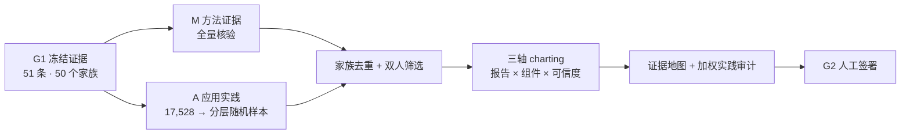

# 网络药理学发展现状｜G2 方案简报 v1

> 状态：方案内容完成，等待 G2 人工签署｜范围：PubMed-only methodological orientation

## 核心方案

G2 已把 G1 的证据判断转成可执行设计：**PubMed 限定的方法学范围综述 + 分层随机抽样的应用研究审计**。M 通道全量筛选方法评价、指南、数据库比较与复现研究；A 通道从 17,528 条母集按 2018—2020、2021—2023、2024—2025 各抽 200 个研究家族，2026 抽 100 个并单列。纯计算、弱验证、负结果和强闭环都可进入，避免只看“高级案例”而高估领域质量。E（药物实体/暴露）、O（疾病情境）、C（结合/占有与功能介导）是非互斥组件；定向补入案例不进入实践分母。

每篇研究分三轴评价：一看数据版本、阈值和参数是否足以重建；二看机制证据组件；三看循环验证、数据泄漏、比较公平性、暴露/模型匹配和结论越级。E3a 的结合/细胞占有与 E3b 的靶点特异功能介导分列，任何一项都不能单独证明“药物经该靶点产生表型”；E4 还要求物种、剂量、时间和靶部位暴露对齐。三轴不合总分，E0—E5 不是经验证的质量量表。

完整 middle-out 的体外主张须有明确实测药物实体，体内主张须有相应物种和剂量下的可达暴露，同时还要有疾病模块，以及靶点特异扰动确实改变药物表型效应。它只是路线标签；完整“药物—靶点—表型”因果还需 E3a 结合/占有和浓度或暴露相容。只满足两项写作 `partial middle-out`。

## Protocol Logic Map

**图注：**M/A 是证据通道，E/O/C 是逐篇抽取组件。只有 A 的随机样本完成全文双人编码后，才可生成 PubMed 限定的加权实践比例。

## 能回答与不能回答

方案可回答预测为何不稳定、文献把什么称作“验证”、闭环最低需要什么，并在 2018—2025 的随机样本内报告带 95% CI 的时期差；已预设 Hájek 域比例、Taylor 方差、有限总体修正和缺失结局界限。Protocol 遵循 JBI，最终报告按 PRISMA-ScR，检索按 PRISMA-S 呈现。[JBI](https://jbi-global.atlassian.net/wiki/spaces/MANUAL/pages/355862619/10.2%2BDevelopment%2Bof%2Ba%2Bscoping%2Breview%2Bprotocol) [PRISMA-ScR](https://www.prisma-statement.org/scoping) [PRISMA-S](https://www.prisma-statement.org/prisma-search)

它不能代表跨数据库、跨语种全景，也不能证明全球“范式转移”或临床有效。2026 是不完整快照；路线占比在全文编码及新的人类批准前仍被禁止。投稿级完整范围综述需要重开 G1、增库并完成 PRESS。

## 唯一待决定

回复 **“批准 G2”** 可冻结 Protocol 与试填 Schema 基线并进入 G3；试填后的字段变化必须升版。也可回复 **“修改 G2：……”** 或 **“升级多数据库”**。
