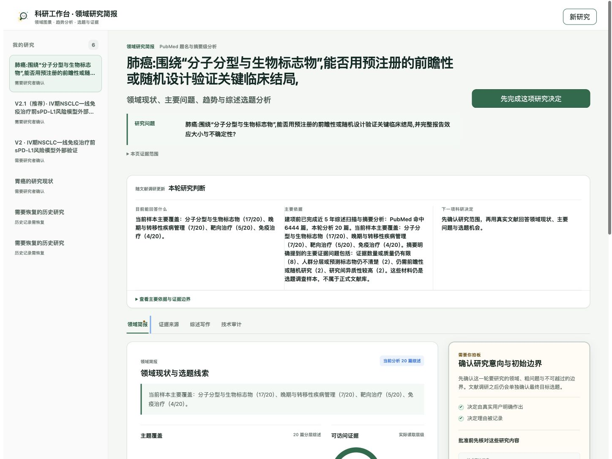
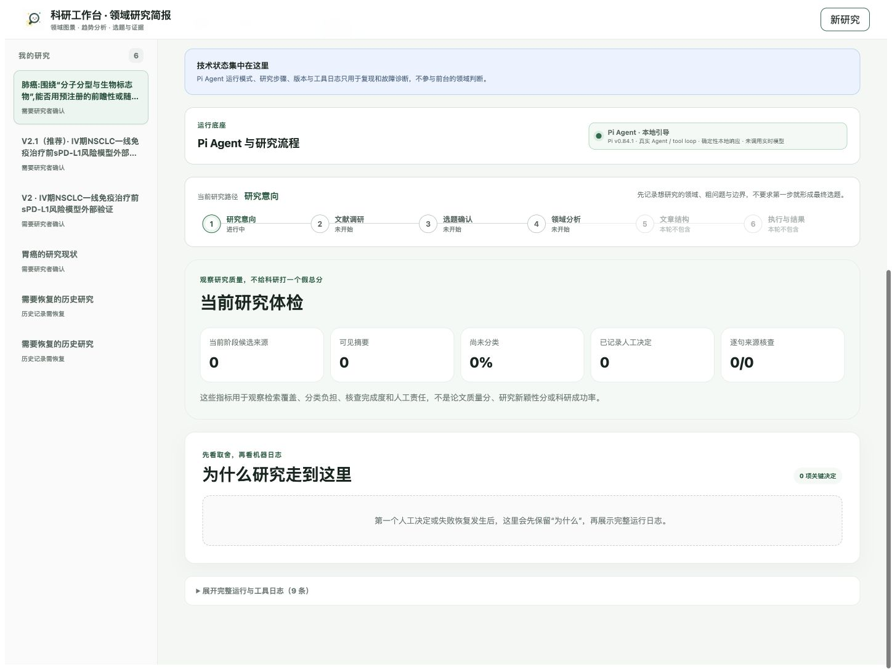

# Research Workbench v0.1.3：领域优先信息架构复核

日期：2026-08-28

## 发布结论

本轮修正的不是配色或局部文案，而是科研工作台的前后台信息边界：研究者首先看到领域现状、主要问题、趋势判断、候选综述方向与下一项科研决定；Pi Agent 运行模式、研究步骤、版本、哈希和工具日志集中进入“技术审计”。

底层仍然基于 Pi Agent。Pi 负责工具循环、恢复、可追溯执行与 fail-closed 科研合同，但不再主导研究者的首屏阅读顺序。

## 前台阅读顺序

1. 领域简报：当前样本能支持的领域判断、主题覆盖和具体问题。
2. 研究者决定：需要确认的研究范围、选题或证据边界。
3. 证据来源：PMID、题名、年份、期刊、访问层级和完整纳入记录。
4. 综述写作：只在研究阶段允许时呈现论证与逐句核查。

“技术审计”单独承载 Pi 版本、运行模式、研究旅程、质量计数、版本绑定与日志，不参与前台领域结论。

趋势章节只把“近两年主轴编码 / 近两年样本”与“较早主轴编码 / 较早样本”作为当前样本内信号；期刊分散只用于否定“成功选题期刊公式”。把热点改写为人群、场景、比较、结局和验证层级，是选题方法建议，不再伪装成样本已经证明的时间演变。

## 科研边界

- 当前示例仍是 PubMed 题名与可用摘要级分析；摘要未报告保持未知。
- 20 篇分层样本用于领域扫描和选题调查，不代表全量文献计量或完整领域成熟度。
- 低覆盖不是研究空白；候选方向必须比较近两年同题综述并估算原始研究量。
- PMID 与逐篇账本继续保留，只从主阅读流移到按需证据入口。
- 相关性、清单完整性和旧报告失效仍然 fail closed；只是不再向研究者暴露内部字段名。

## 验证

- Core：285/285
- Workbench model：9/9
- Report UI：14/14
- API E2E：1/1
- Production build：通过
- `git diff --check`：通过
- 1448 × 1086：无页面级横向溢出
- 390 × 844：无页面级横向溢出；技术审计中的 Pi 运行信息仍可访问

## 浏览器证据

## 未被夸大的结论

这一版证明的是产品信息架构与科研边界没有互相破坏，不证明候选方向已经构成研究空白，也不证明 20 篇样本能够代表完整领域趋势。正式立题仍需方向级窄检索、同题综述比较、原始研究量核查和必要全文审计。
