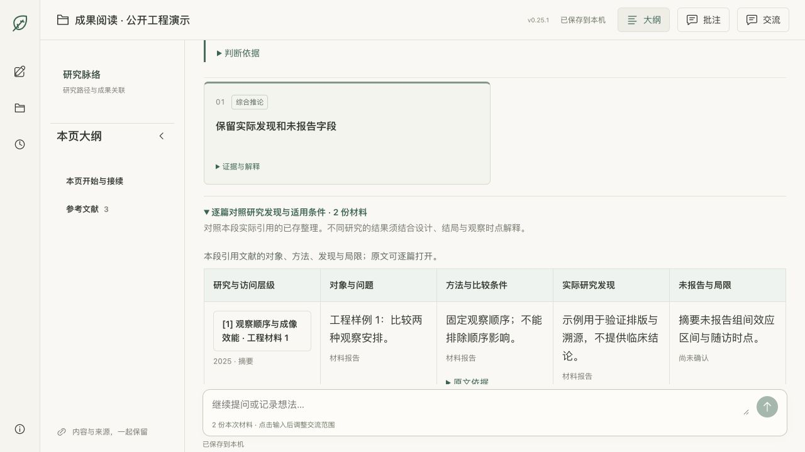
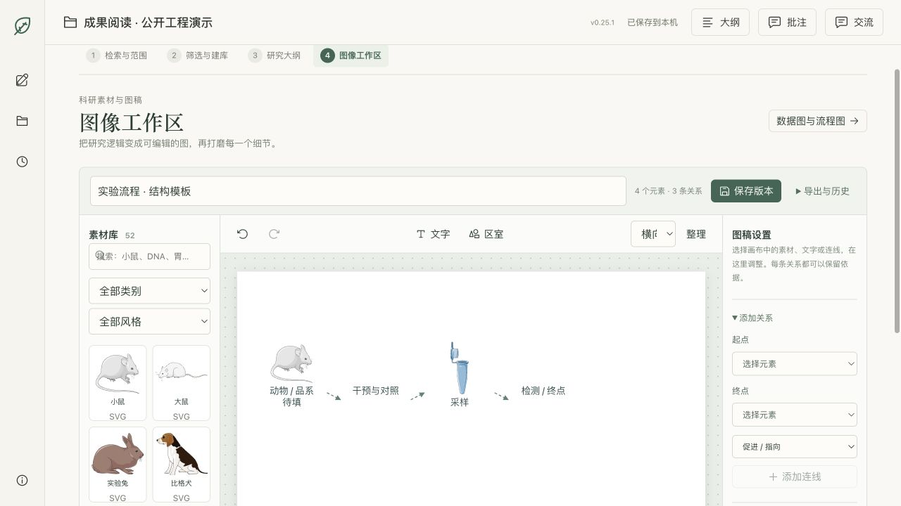

# 科研工作台第二版：结果导向的轻量审查

2026-09-12。本轮以本地 `research-workbench-v2.0` 为主证据，从提交 `a8be7e3`（Demo v0.25.1）建立隔离副本，核对最新决定、实际代码、现有测试和浏览器行为。旧 v0.1.4 与公开 v0.2 方向仅作对照。

**结论：第二版已进入本人可使用的本地 Demo 与体验修订阶段。** 从材料进入到领域理解、选题、专题文献库、大纲、正文、模板精读和可编辑图稿，已有真实实现；保存与恢复也有专门工程机制。它不是仅有设计稿，也还不是多用户 Beta。有限任务编排和模板选择已经存在，任意动态研究路径及研究充分性的自动闭环尚未成立。

公开冻结版本：**Demo v0.25.2**（v0.25.1 基线加本轮审查修订）。此版本与同期领域图解开发分别验收。

## 本轮直接修复

| 问题 | 影响 | 处理 |
|---|---|---|
| P1：本地 README 与公开页面仍称第二版尚未开发 | 外部审查无法正确判断当前进度 | 更新公开基线、运行方式和验证边界，旧发布记录保留 |
| P2：综合论证有引用，但逐篇结果难直接比较 | 阅读者需要来回打开原文，难并列核对对象、方法和局限 | 在现有证据论证中加入按需展开的逐篇对照，复用保存记录与原文入口 |
| P2：结果导向原则分散在不同阶段文档 | 模型可能继续给流程说明而非具体认识 | 接入所有已有科研生成入口共用的表达规范，不增加润色模型调用 |
| P2：SVG 带来源但未携带明确的草稿状态 | 文件离开页面后可能丢失待审阅语境 | SVG 描述与元数据保留待审阅状态，不修改科学内容 |

采用 [Ponytail 核心方法](https://github.com/DietrichGebert/ponytail/blob/main/skills/ponytail/SKILL.md)：检查真实路径，复用已有能力，只补必要实现。没有新依赖、重建状态机或新增科学审批。统一原则见[结果导向设计](research-workbench-results-first-design-2026-09-12.md)。

## 七层核对

| 层面 | 本轮判断 | 直接依据与边界 |
|---|---|---|
| 有效基线与决定 | 已核对；公开状态原先失真 | 底层逻辑、当前断点、后续决定与图文规则优先于历史路线；公开 v0.2 是2026-09-04计划，目录 v2.0 是第二代，0.25.x 是 Demo 包版本 |
| 产品范围与完成度 | 本地核心链已有实现，部分环节本次浏览器验证 | `demo-app/src/Workspace.jsx`、`TopicLibraryWorkbench.jsx`、`ManuscriptWorkbench.jsx`、`TemplateReader.jsx`、`FigureWorkspace.jsx`；不是全链真实模型质量复验 |
| 科研逻辑 | 工程边界已实现且本次测试通过，科学质量待持续核查 | `demo-api/src/kernel.mjs`、`workflows.mjs`、`topic-review.mjs`：用户采纳、实际访问、跨材料引用与版本分开；摘要未报告不等于未实施 |
| Agent 与编排 | 有限自适应，部分实现 | 任务注册表、有界批次与可恢复运行；选题和专题有白名单模板；不是模型随意造流程、执行代码或自动裁决充分性 |
| 前端与交互 | 主画布成果导向；对照阅读已补齐 | 实际领域与选题页面只读走查；合成专题中核对大纲、对照、来源与作图；桌面与390px无页面横向溢出，对照表在自身区域滚动 |
| 可靠性与隔离 | 本地机制本次测试通过；多人能力未实现 | SQLite 事务、幂等、不可变版本、恢复、精确导出、跨课题引用拒绝和环回来源检查；本地项目隔离不等于多用户身份隔离 |
| 验证与下一优先级 | 工程证据较完整，用户价值证据不足 | 原281项与优化后282项通过，构建通过；未执行真实模型质量对照、外部研究者测试、付费意愿或多用户安全测试 |

代码路径均相对于[第二版源码目录](../research-workbench-v2.0/)。测试不是产品完成百分比。

## 领域理解审查

当时实际页面仍以研究地图、发展脉络与证据分布展示已存报告；完整原文和研究分支可达。首屏的材料数量与过长概括难以说明“究竟得到了什么”。2026-09-12的新决定要求以历年综述内容变化、具体发现和问题缺口组织认识，数量视图降为辅助。

本轮将这些原则加入共用生成规范。独立领域图解任务正在修改界面和补检流程，其未提交文件没有混入本轮冻结发布；本报告不把并行开发中的图稿或源码称为已验收。后续合并应核对新页面、保留原版本和补检范围，单独验证真实材料下的效果。

材料量应由内容贡献和剩余问题解释，不能用固定篇数证明领域已理解。综述与原始研究的日期、覆盖范围、重复引用与实际访问深度应分别说明。当前还没有经验证的自动充分性判断器，本轮也未增加这类机制。

## 文献比较审查

现有专题综合已要求对象、设计、结局和条件比较，并拒绝非法引用；选题比较允许保留未知和没有候选。缺口是“综合论点”到“逐篇研究事实”的阅读距离。

新对照按本段引用找到相应 `accessId`，只显示该次综合范围内的逐篇整理，保留研究题名、年份、访问层级、对象、方法、发现和未报告字段；原文片段可展开，文献按钮复用已有来源侧栏。不触发模型、不更新材料、不把较新的全文替换进旧摘要比较。已有记录缺字段就保留未知。

当前对照并不自动判定研究可比、独立性或质量，也不进行 Meta 分析。详细终点、随访、效应区间等未被原整理记录的内容，需要针对性核查；不能从表格存在推断条件已齐备。

## 图文、模板与正文审查

当前实现含52项带来源/许可记录的素材、三种机制/流程结构模板、关系类型、局部编辑、撤销、版本及SVG/PNG/JSON导出。基础数据图来自CSV输入，模型仅可在给定文字与素材目录内提出候选。全文模板分析有逐页文字与精确引句定位，图像像素检查仍由人工完成。

已有能力不等于完整出版流水线：图像工作区当前保存草稿，尚未形成完整人工采用/失效依赖状态；数据图来源仍可为用户输入文本，并不强制绑定可复现分析版本；目标期刊检查仍以提示为主；没有通用生图供应商集成。新增SVG草稿元数据只避免状态丢失，不填补上述能力。

## 浏览器走查

| 步骤 | 健康度与观察 |
|---|---|
| 1 实际领域结果与选题比较 | 可进入已有成果与依据；内容层级仍需按新规则改进，实际旧科研内容未重写 |
| 2 合成专题的大纲与证据 | 章节与来源相连；材料变化提示仍保留，不自动确认候选大纲 |
| 3 新逐篇对照 | 两份已引用材料正确显示，未引用第三份不混入，未知保留；来源侧栏打开对应摘要 |
| 4 窄屏与键盘 | 390px页面无横向溢出；对照表自身可滚动，键盘可聚焦并横移40px；未做完整屏幕阅读器认证 |
| 5 图像工作区 | 模板、素材与待验证关系可见且可编辑；没有启动真实模型或把模板当真实实验 |

公开截图仅采用标明工程演示的隔离材料。实际课题截图只留在本机；没有上传工作区数据库、模型配置或私人材料。

## 验证、风险与下一步

- Node 22.23.1；原始基线281项通过，优化后282项通过；公开副本通过独立 `npm ci`、282项测试与生产构建。新增回归检验重复引用去重、精确访问版本、越界材料排除、未知保留与只读性。
- 现有回归覆盖保存冲突、幂等、恢复、导出、非法引用、任务取消、批次复用、模板页码、图稿输入和素材哈希。全部为相应工程断言，不是临床或科研有效性检验。
- 本轮没有新增真实科研模型调用，相关模型费用为0；既有调用记录不重算成本。历史真实模型输出没有因本轮测试通过而获得重新认证。
- 前端仍有大于500kB的构建包提示；PDF与编辑能力有真实用途，暂不为消除提示重构应用。若实测首屏延迟影响使用，再做针对性按需加载。
- 当前服务限定本机，不公开部署科研后台；个人网站只展示项目与审查。未来托管需独立身份、存储隔离、作业配额与恢复验证。

下一步优先用同一真实问题验证：研究者能否看懂核心发现、指出不可比条件、找到正确来源并作出下一项取舍；同步验收正在实现的领域图解与缺口补检。其后再决定图文依赖检查和多人能力，避免继续堆叠模板数量。
